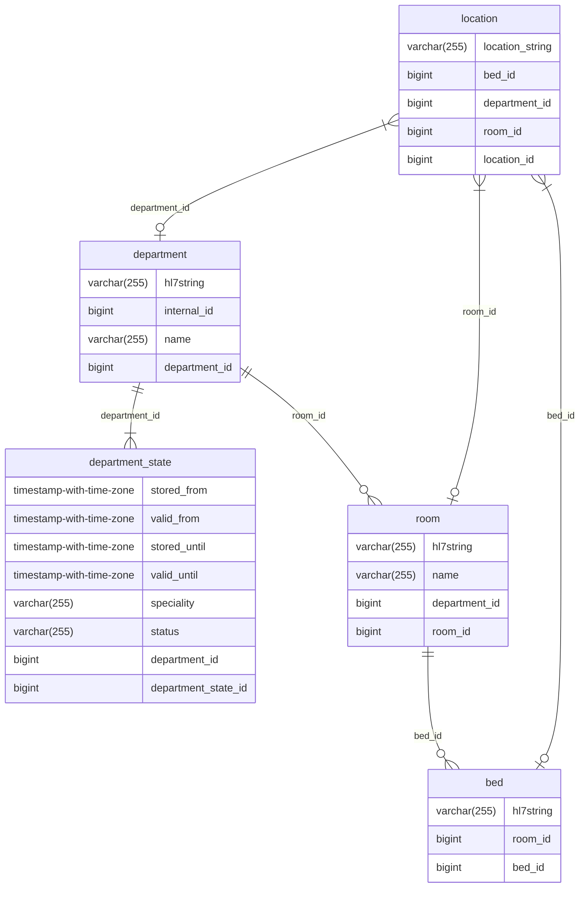

# EMAP Release

**Date: 2024-02-14 Changes in this release**

---

### Changes/fixes

- We have added a healthcheck endpoint for the hl7-reader, so that users can check the status of the hl7-reader without
  needing to access the server directly.
    - The current live version can be found at: `http://<GAE hosting EMAP>:8080/actuator/health`
    - Please contact the developer team to find out the GAE hostname.
- All services now run using Java 17 (LTS)
- Open source release using mono-repo
- Improved testing to ensure database consistency

### Tables changed

Department specialities can change over time, we've updated the database to reflect this.
The following tables have been updated:

| Table           | Attributes added | Attributes removed |
|:----------------|:-----------------|:-------------------|
| DepartmentState | speciality       | -                  |
| Department      | -                | speciality         

---
<!--
## Data sources

### Repository Versions

| Repository            | Version |
| :-                    | :-:     |
|Hl7-processor          | 2.7     |
|Emap_interchange       | 2.7     |
|Emap-Core              | 2.7     |
|Inform-DB              | 2.7     |
|Hoover                 | 2.7     |
>
