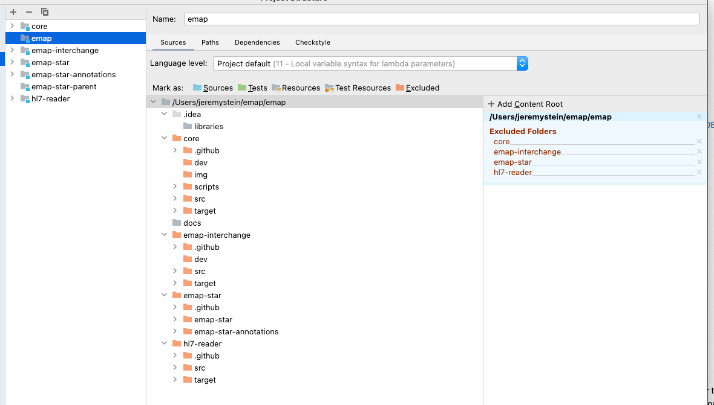
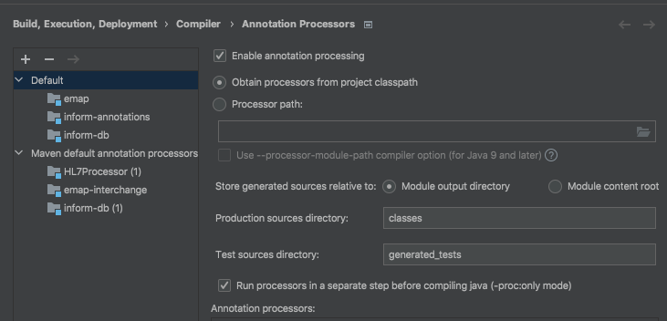
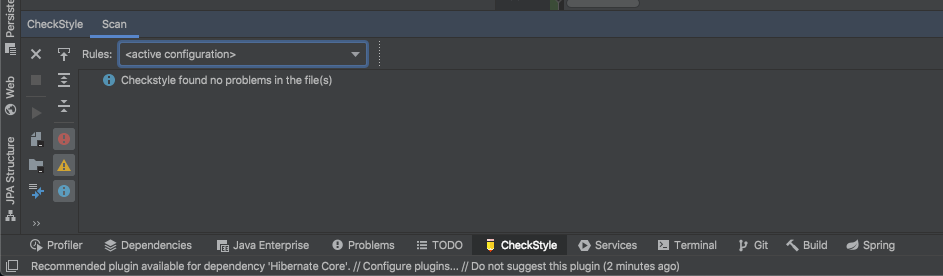

# IntelliJ project setup

For all code in monorepo + hoover.

## Local setup instructions using IntelliJ IDEA

These setup instructions are aimed at developing in [IntelliJ IDEA](https://www.jetbrains.com/idea/), but hopefully should be similar in [Eclipse](https://www.eclipse.org/downloads/).

1. <details>
    <summary>Create a parent directory</summary>

   Create a directory where all the repositories, including this one, will be cloned
   e.g.

    ```bash
    mkdir ~/projects/EMAP
    ```
</details>

2. <details>
    <summary>Clone repositories</summary>

   This repo is now a monorepo that contains the source code from several pre-existing repos (Emap-Core Emap-Interchange Inform-DB emap-hl7-processor).

    ```bash
    cd ~/projects/EMAP
    git clone https://github.com/UCLH-DHCT/emap.git
    git clone https://github.com/inform-health-informatics/hoover.git
    ```

</details>

3. <details>
    <summary>Open project in IntelliJ IDEA</summary>

   <b>File > New > New Project From existing sources</b> and select this repository directory (e.g. `~/projects/EMAP/emap`). 
   When prompted, choose "Create project from existing sources"

   "Unmark All" if prompted to select source files for the project.
</details>

4. <details>
    <summary>Add Maven projects</summary>

   <b>File > Project Structure > Modules </b>
   
   Click the plus to add a new project and select the following `pom.xml` files

   - `core/pom.xml`
   - `emap-interchange/pom.xml`
   - `emap-star/pom.xml` - NOT to be confused with `emap/emap-star/emap-star/pom.xml` (which contains the Hibernate entity definitions, but requires the annotation preprocessor)!
   - `hl7-reader/pom.xml`
   - `../hoover/pom.xml` (optional for running within UCLH, outside this repo)

   If you add one by mistake, you can delete the project

   

</details>

5. <details>
    <summary>Allow annotation processing</summary>

   Go to <b>File > Settings > and searching for `processor`</b>
    - Check `enable annotation preprocessing`
    - Change the production sources directory to `classes` as below

   
</details>

6. <details>
    <summary>Reload Maven projects</summary>

   In the `Maven` pane (which should now have appeared on the top right of the IDE),
   click **Reimport all maven projects** or **Reload**
</details>

7. <details>
    <summary>Point to correct Java versions</summary>

    There are several places in IntelliJ that relate to the java version used.
    These settings are sometimes correctly set from the maven config but you may want to double check in case of errors.
    `Project Structure | Project Settings | Project` (SDK to use and default language level)
    `Project Structure | Project Settings | Modules` (per module language levels)
    `Preferences | Build, Execution, Deployment | Compiler | Java Compiler` (Project bytecode version and per-module bytecode version)
    `Preferences | Build, Execution, Deployment | Build Tools | Maven | Importing` (JDK for importer)

    At the time of writing, hoover uses java 11 and all other modules use java 17.
</details>

8. <details>
    <summary>Add lombok and checkstyle plugins</summary>

   Go to <b>File > Settings > search for plugins</b>, search lombok and checkstyle and install them
</details>

9. <details>
    <summary>Setup checkstyle</summary>

   To allow checkstyle to be run go to <b>File > settings > search for checkstyle</b>
    - Set the version of checkstyle to the latest version
    - Click on the `+` to add a new checkstyle configuration

   

    - Make a description and select the checkstyle file `emap/emap-checker.xml`. When done, in the bottom panel of the IntelliJ select the inform rules to make the new configuration active.
      
</details>

## Running unit tests

Most repositories include unit tests in `<repo-name>/src/test/java`. 
You will probably want to set up a separate run config for each component so you can just
run the tests that are relevant.

The following modules can be set up in the same, very simple way:
- core
- hl7-reader
- emap-star

Others require some "fake" services which run in docker containers.

### Setting up modules that don't require docker containers to run

Creating a configuration as follows:
   - <b>Run > Edit Configurations</b>
   - Click on the `+` at the top left-hand side of the window
     
   - Select `Junit` from the drop down
      - Set Test kind to `All in package`
      - Set the package to `uk.ac.ucl.rits.inform.datasinks.emapstar`. Or set the module to e.g. `core` and the package to `uk.ac.ucl.rits.inform`
      - You may also want to set logging level to TRACE for our classes by defining the environmental variable:
        `LOGGING_LEVEL_UK_AC_UCL=TRACE`

You can just copy this configuration for the other modules, changing the module name each time.

### Compiling and running tests

   Go to <b>Run > Run</b>, which should create a window in the bottom pane
   

<details>
   <summary>Expand here if this gives you a compilation error</summary>

This may be fixable like so:
   - Go to the maven pane on the right-hand side and
     run the Lifecycle `clean` goal for: `Emap Star Annotations` and `Emap Star Database Definition`.
     Then `clean` and then `install` on `Emap Star Schema`
   - After this then select the `Reload All Maven Projects` icon at the top of the same pane as shown below

     

   - You may also need to run `Generate Sources and Update Folders For All Projects`
</details>

Tests can also be run individually by clicking the play button on a class within an IDE editor window.

### For components which require a docker container to run tests

Don't delete the fakeuds definition because it's needed for emap-in-a-box, and it will be needed if we bring the non-proprietary bits of hoover into this repo.
